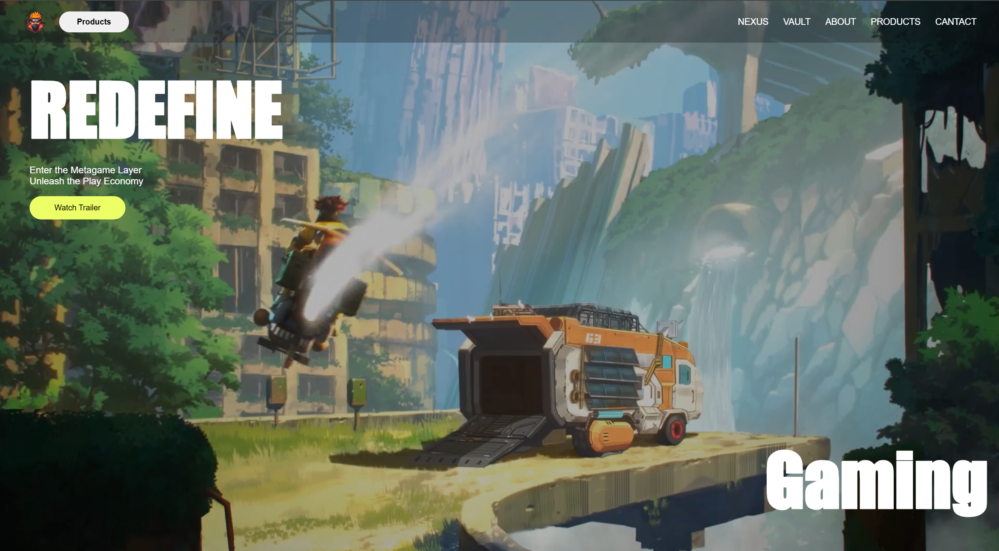

# 🎮 Gaming Website - Zentry

Welcome to **Zentry**, a futuristic and immersive gaming concept website. This site showcases an innovative gaming experience blending Web2, Web3, NFTs, AI, and a gamified social hub into one unified **Play Economy**.

---

## 🚀 Features

- 🎥 Full-screen immersive background videos
- 🕹️ Metagame-inspired hero section
- 🧠 AI-enhanced gaming concepts
- 🧩 Modular sections: Nexus, Vault, About, Services, Contact
- 📽️ Dynamic video cards for showcasing features
- 📱 Fully responsive layout (mobile-friendly)

---

## 🛠️ Built With

- **HTML5**  
- **CSS3**  
- **JavaScript**  
- **Boxicons** (for icons)  
- Video and image assets

---

## 🌐 Live Demo

> 🔗 [View Live Website](https://your-github-username.github.io/Gaming-Website/)  

---

## 📬 Contact

Made with ❤️ by **Pravin Malge**  
Feel free to reach out for feedback or collaboration!

---

## ⚡ Hosting Instructions (GitHub Pages)

1. Push all files to your GitHub repository
2. Go to `Settings` → `Pages`
3. Select branch: `main`, folder: `/root`
4. Hit Save — your site will be live at  
   `https://PravinMalge.github.io/Gaming-Website/`

---

## 📸 Screenshots

https://github.com/user-attachments/assets/b04d3665-772b-4d5c-9492-5d0487d54f19

